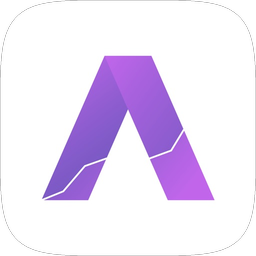

## Bruno Zampirom

**Senior React Native Engineer** · Mobile Platform & On-Device AI · Brazil

I work on the layer other teams build on: the React Native core, the design system and the native API surface. Less shipping screens, more owning what everything else runs on.

 

#

  <a href="https://github.com/brunozampirom">
  

## What I do

- **Platform, not features.** I own a React Native core and the internal libraries feature teams
build on: the design system, the integrations layer, the native APIs. That includes leading version
and New Architecture migrations across a multi-repo ecosystem, and running the CI and release train
behind them.
- **AI in two directions.** In product: an AI assistant, and podcasts and practice tests generated
from whatever files a student uploads. In tooling: the agentic skills a mobile fleet uses to automate
React Native upgrades, audit performance, and drive tests on real devices.
- **Where JavaScript meets native.** Startup instrumentation with TTID on the first frame and launch
types classified off a monotonic clock, native modules and SDK integration, and the performance work
that only shows up once you measure it properly.
- **Ship end-to-end.** My own apps go from blank repo to both stores: auth, monetization, analytics,
crashlytics, store compliance, and everything that comes after launch.

## Stack

`React Native` `TypeScript` `Expo` `Expo Router` `New Architecture` `Reanimated` `FlashList`
`Cloudflare Workers` `Durable Objects` `WebSockets` `Firebase` `Algolia` `TanStack Query` `Zustand`
`Redux Toolkit` `Turborepo` `EAS Build` `Jest` `Maestro` `Datadog` `Flashlight`

---

## Featured apps

Three apps shipped solo on both stores, different complexities, same end-to-end execution.

###  My Whisky

Social whisky catalog. Browse brands, countries and kinds, review and rate whiskies, follow other
drinkers, full-text search across the catalog.

 

**Stack:** Expo, Redux Toolkit, Firebase (Auth/Firestore/Storage/Analytics/Crashlytics), Algolia +
InstantSearch, Legend List, FastImage, i18n (PT/EN), New Architecture enabled, Apple & Google
Sign-In.

---

###  Analyzer: Stock Market

Personal stock-market app for the Brazilian (B3) and US markets. Portfolio tracking, indicators,
charts, premium tier, biometric login, push alerts. Now on its thirteenth major version.

 

**Stack:** Expo Router, TanStack Query (offline-persisted), Zustand, Firebase
(Auth/Firestore/Analytics/Crashlytics/Performance), Reanimated 4, FlashList, Google Mobile Ads,
biometric auth, in-app review.

---

###  Sintonia: Party Game

Party game inspired by *Wavelength*. Guess where on a hidden spectrum a clue lands, around a table or
online. One pure reducer runs on both the app and the server, so the rules exist in exactly one place
and the server is the only thing that ever sees the hidden target.

  

**Stack:** Turborepo monorepo with a shared game core, Expo SDK 54, Expo Router, Reanimated 4 +
worklets, i18next (PT/EN/ES), PartyServer on Cloudflare Workers with one Durable Object per room,
EAS Build with auto-submit.

#

[brunozampirom@outlook.com](mailto:brunozampirom@outlook.com) ·
[LinkedIn](https://www.linkedin.com/in/bruno-de-almeida-zampirom)
